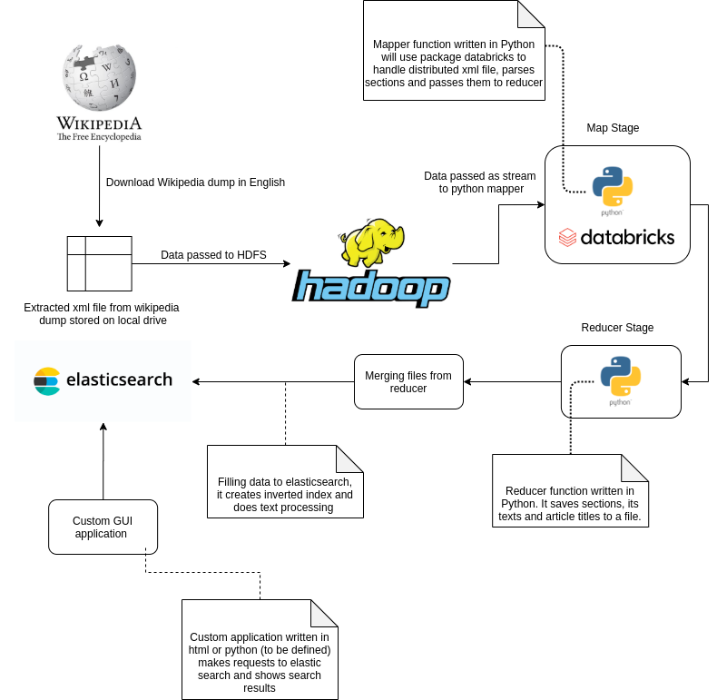

# hadoop-wiki-sections-parser

School project from subject Information Retrieval

Planned architecture:

Spravit si zakladny prehlad extraktivnej sumarizacie a porozmyslat ako by sa tam dal zapojit anchor.
Pripadne pozriet ako pouzit ine explanatory 

----
### Update 19.10.

how to run pyspark shell with databricks **spark-xml** lib 

`pyspark --packages com.databricks:spark-xml_2.12:0.10.0`

> works when environment variables are set correctly: https://phoenixnap.com/kb/install-spark-on-ubuntu

to submit app to spark with **spark-xml** run:

`spark-submit --packages com.databricks:spark-xml_2.12:0.10.0 example.py`

> mind the order, first type in packages, then file

Run master process
`start-master.sh`

Run random worker process
`start-slave.sh spark://tomasmizera:7077 -c 4 -m 4G -d raw-data/spark-logs`
